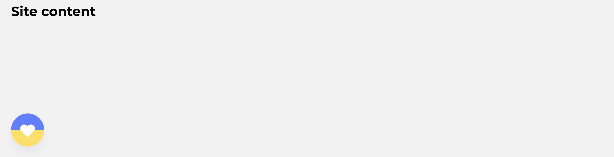
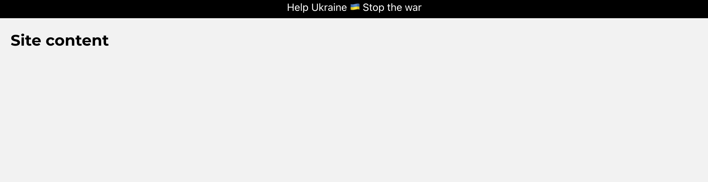

# Ukraine Support Button and Stripe for Website

Add code from `ukraine-support-website-button.html` and/or `ukraine-support-website-stripe.html` to the `<head>` tag of your website.

## Button example

## Stripe example

---

## About the maintainer

**Maintained by [Vladimir Mikhalev](https://github.com/heyvaldemar)** · Docker Captain · IBM Champion · AWS Community Builder

[YouTube](https://www.youtube.com/channel/UCf85kQ0u1sYTTTyKVpxrlyQ?sub_confirmation=1) · [Blog](https://heyvaldemar.com) · [LinkedIn](https://www.linkedin.com/in/heyvaldemar/)

