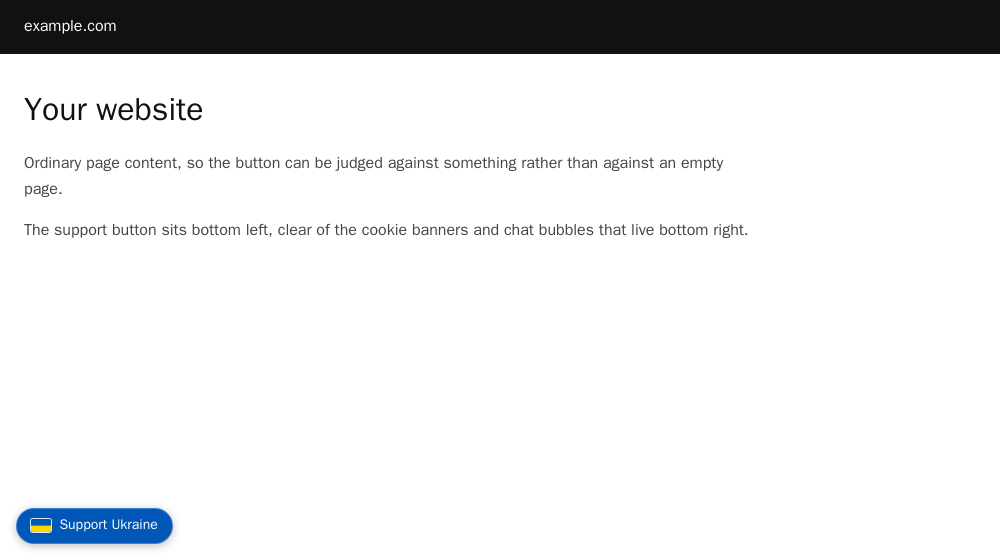
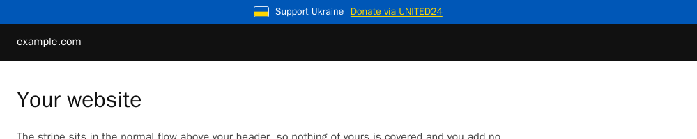

# Ukraine support button and stripe for a website

Two snippets that add a Support Ukraine button or a stripe to any site, with **no external requests and no JavaScript**. Paste one into `<body>` and you are done.

```html
<!-- the button: bottom-left corner -->
<a class="u-support" href="https://u24.gov.ua/" ...>...</a>
```

## What this replaced, and why

Until September 2026 both files were a single `<script>` tag pulling a widget from a public CDN. It worked. It also meant every visitor to every site using these snippets fetched 7,576 bytes of JavaScript from a third party, on every page load, with no `integrity` attribute: whatever was at that address would execute in the page. The repository behind it had not been touched since July 2022 and carried no licence at all.

Nothing about that had gone wrong. It is simply a dependency nobody needs for a coloured bar with a flag on it, and one that can change under you without warning.

So these are written from scratch:

| | before | now |
|---|---|---|
| External requests per page view | 1 (CDN) | 0 |
| JavaScript | 7,576 bytes | none |
| Can change without you | yes | no |
| Works with scripting off | no | yes |
| Size | 7,576 bytes fetched | about 2.7 KB of markup, inline |

The flag is an inline SVG, the styling is a `<style>` block beside it, and the only network request either file can cause is the one a visitor makes by clicking the link.

## The button



Paste [`ukraine-support-website-button.html`](ukraine-support-website-button.html) anywhere in `<body>`. It is `position: fixed` in the bottom-left corner, which keeps it clear of the cookie banners and chat bubbles that live bottom right.

## The stripe



Paste [`ukraine-support-website-stripe.html`](ukraine-support-website-stripe.html) as the first thing inside `<body>`.

It sits in the normal document flow rather than floating over the page. A fixed bar covers whatever is under it, which on most sites is the navigation, and then every user of the snippet has to add padding somewhere to compensate. This one pushes the page down by its own height and nothing of yours is hidden.

## Changing where it points

The default is [UNITED24](https://u24.gov.ua/), the official fundraising platform of Ukraine. Both files carry the URL once, on the `href` of the link, with a comment above it. Change it to whichever fund you prefer.

## Details worth knowing

**Accessibility.** Each snippet is one link with an `aria-label` naming the destination, a visible focus ring in the flag's yellow, and a call to action that is underlined rather than distinguished by colour alone. The flag carries `aria-hidden` because it is decoration next to text that already says what this is.

**The flag has a ring around it.** Its top half is the same blue as the button and the bar, so without a one-pixel light outline the blue half disappears and what is left reads as a yellow dash. That was found by looking at a render rather than at the code.

**Content Security Policy.** Both files include a `<style>` block. If your site sets a CSP that forbids inline styles, move that block into your stylesheet; nothing else needs changing, and there is no script to hash or nonce.

**Print.** Hidden on paper, in both.

---

## About the maintainer

<div align="center">

**Maintained by [Vladimir Mikhalev](https://github.com/heyvaldemar)** · Docker Captain · IBM Champion · AWS Community Builder

[YouTube](https://www.youtube.com/channel/UCf85kQ0u1sYTTTyKVpxrlyQ?sub_confirmation=1) · [Blog](https://heyvaldemar.com) · [LinkedIn](https://www.linkedin.com/in/heyvaldemar/)

</div>
